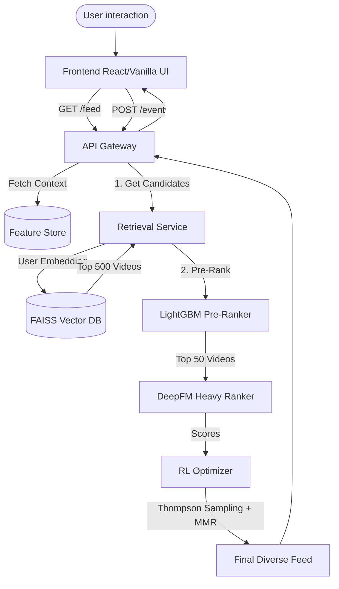

# ReelMind — Autonomous Short-Video Recommendation Infrastructure

<div align="center">
  <em>A production-grade ML infrastructure simulating the backend of platforms like TikTok, YouTube Shorts, and Instagram Reels.</em>
</div>

---

## 🎯 The Vision

ReelMind is not just a UI clone of TikTok. It is a **full-stack machine learning infrastructure project** designed to showcase how modern, large-scale recommendation systems operate under the hood. 

While the frontend provides a clean, familiar interface for interacting with videos, the true complexity lies in the backend: **a distributed, 5-stage microservice architecture** that handles feature extraction, fast vector retrieval, tree-based pre-ranking, deep neural network heavy ranking, and reinforcement learning-based exploration—all executing in under 100 milliseconds per request.

---

## 🧠 System Architecture

The recommendation flow follows the industry-standard **Candidate Generation → Heavy Ranking → Re-ranking** paradigm. 



### The 5-Stage Pipeline

1. **Feature Engine**: An ultra-low latency service retrieving user historical interactions, session states, and video metadata.
2. **Retrieval (Two-Tower PyTorch + FAISS)**: Filters the corpus from millions of videos down to ~100. The Two-Tower model encodes users and videos into the same embedding space, and FAISS performs sub-millisecond Approximate Nearest Neighbor (ANN) search.
3. **Pre-Ranking (LightGBM)**: A fast, tree-based gradient boosting model that scores the 100 retrieved candidates and passes the top 50 to the heavy ranker.
4. **Heavy Ranking (DeepFM PyTorch)**: A Deep Factorization Machine that computes high-fidelity interaction probabilities by modeling complex, high-order, non-linear feature interactions (e.g., User Age × Video Category × Time of Day).
5. **Re-Ranking (Reinforcement Learning)**: A Contextual Bandit using **Thompson Sampling** and **Maximal Marginal Relevance (MMR)** to inject diversity and exploration, preventing the "filter bubble" effect common in pure CTR-optimized models.

---

## 💻 The Three Dashboards (What to Demo)

ReelMind includes three distinct web interfaces to visualize the ML pipeline in action:

1. **The Main Feed (`http://localhost:8001`)**
   * A TikTok-style scrolling feed where user interactions (likes, skips, watch time) are captured.
   * **Key Feature:** The feed adapts in real-time. Liking multiple comedy videos instantly updates your backend affinity vector, changing your subsequent recommendations. Includes a "Cold Start" simulator to test new users.

2. **The ML Analytics Dashboard (`http://localhost:8001/analytics`)**
   * A real-time, auto-refreshing dashboard showing the system's internal understanding of the user.
   * **Key Feature:** Visualizes category affinities, session retention scores, pipeline execution latency (in milliseconds), and the exact ML score and source for every video in the current feed.

3. **The System Pipeline Dashboard (`http://localhost:8001/dashboard`)**
   * An infrastructure observability tool simulating Grafana.
   * **Key Feature:** Run a load simulation to see the P50/P90/P99 latency breakdowns across the Retrieval, LightGBM, and DeepFM microservices.

---

## 🛠️ Technology Stack

**Machine Learning & Data**
* **Models**: PyTorch (DeepFM, Two-Tower), LightGBM
* **Vector DB**: FAISS (IndexHNSWFlat)
* **Experiment Tracking**: MLflow
* **Data Processing**: NumPy, Pandas, Scikit-learn

**Backend & Infrastructure**
* **Microservices**: FastAPI, Uvicorn, Python `asyncio`
* **State Management**: In-memory Session Store (simulating Redis/Kafka event streams)
* **Containerization**: Docker & Docker Compose (Optional for Kafka/Postgres setup)

**Frontend Visualization**
* Vanilla JavaScript, HTML5, CSS3 (Designed to be lightweight to keep focus on backend ML)

---

## 🚀 Getting Started

### Prerequisites
* Python 3.9+
* Mac/Linux environment (or WSL on Windows)

### 1. Start the Microservices
The project includes a startup script that launches all 5 FastAPI microservices concurrently and populates the FAISS vector database with synthetic data.

```bash
chmod +x start_servers.sh
./start_servers.sh
```
*(Services will bind to ports 8001 through 8005).*

### 2. Access the Application
Once the terminal reads `✅ All systems go!`, open your browser:
* **http://localhost:8001**

### 3. Run Offline ML Evaluation
To prove the rigorous mathematical foundation of the ranking models, run the offline evaluation pipeline. This generates synthetic ground-truth data and evaluates the model using Information Retrieval (IR) metrics.

```bash
PYTHONPATH=. python -m ml.training.cli evaluate --num-users 200 --num-videos 500
```

**Expected Metric Targets:**
* `NDCG@10`: > 0.35
* `MRR`: > 0.50
* `Recall@100`: > 0.90

---

## 📁 Repository Structure

```text
ReelMind/
├── docker-compose.yml        # Infra (Kafka, Redis, Postgres, Prometheus)
├── start_servers.sh          # Local dev startup script
├── services/                 # Microservices
│   ├── api_gateway/          # Orchestrator & UI serving
│   ├── feature_engine/       # Real-time feature fetching
│   ├── retrieval/            # PyTorch Two-Tower + FAISS
│   ├── ranking/              # LightGBM + DeepFM
│   └── rl_optimizer/         # Thompson Sampling + MMR
├── ml/                       # ML Code
│   ├── data_simulator/       # Synthetic data generation
│   └── training/             # Model training pipelines & Evaluation
├── docs/                     # Deep-dive documentation
│   ├── ARCHITECTURE.md       # Detailed ML architecture specs
│   └── EVALUATION.md         # Metric definitions and targets
└── frontend/                 # Visualization UI
    ├── index.html            # TikTok-style feed
    ├── analytics.html        # User profile & ML explanations
    └── dashboard.html        # System latency visualization
```

---

## 📚 Deep Dive Documentation

For a comprehensive breakdown of the mathematics, algorithms, and engineering choices, refer to the dedicated documentation:

* [**Project Overview (Read First)**](docs/PROJECT_OVERVIEW.md) - A complete summary of what the project does, the microservices, frontend pages, and training methods.
* [**How It Works (Explained Simply)**](docs/EXPLANATION_FOR_BEGINNERS.md) - A beginner-friendly, jargon-free explanation of the ML pipeline using real-world analogies.
* [**System Architecture (HLD)**](docs/SYSTEM_DESIGN.md) - High-Level Design covering microservice infrastructure, data flow, scaling, and fault tolerance.
* [**Architecture & ML Models**](docs/ARCHITECTURE.md) - Deep dive into Two-Tower embeddings, DeepFM architecture, LightGBM configuration, FAISS indexing, and Thompson Sampling.
* [**Evaluation Metrics**](docs/EVALUATION.md) - Detailed explanation of NDCG, MRR, Recall@K, and how the offline evaluation pipeline generates ground truth.

---
*Developed as an advanced M.Tech level demonstration of production AI infrastructure.*
